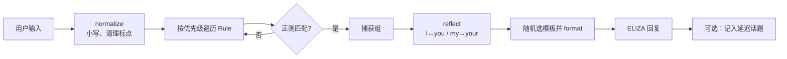

# Simple ELIZA

一个可运行、可阅读、可扩展的早期 ELIZA 风格聊天机器人。它不用大语言模型，也不声称真正理解用户：程序将一句自然语言按**规则优先级**送进正则表达式匹配器，提取其中的片段，进行**代词反射**，再填入一个回应模板。

这正是早期 ELIZA 最值得学习的地方：把看起来困难的“自然语言理解”，拆成可调试的文本规范化、模式匹配、替换和对话策略。

> 注意：这是教学项目，不是心理咨询服务，也不适合紧急或高风险情境。

## 功能

- 零第三方依赖，仅需 Python 3.10+。
- 正则规则按优先级排序，具体意图会先于兜底规则触发。
- 捕获组把用户输入中的关键信息带回回复，例如 `I need help`。
- 代词反射（`I → you`、`my → your`、`you → I`），并以单词边界匹配，避免误改词的一部分。
- 多个响应模板随机选择；传入种子时可复现。
- 小型“延迟话题”记忆：对 need / remember / dream 的回应有小概率在后续轮次重新被提出。
- `goto:` 规则演示：兜底规则能转交给一个更具体的主题规则。
- 单元测试覆盖规范化、反射、规则优先级、家人主题与空输入。

## 快速开始

```bash
python eliza.py
```

示例：

```text
ELIZA: Hello. I am ELIZA. How are you feeling today?
You: I need my family to understand me
ELIZA: Why do you need your family to understand you?
You: My mother worries me
ELIZA: Tell me more about your family.
You: bye
ELIZA: Goodbye. Take care.
```

运行测试：

```bash
python -m unittest -v
```

## 工作流程



### 1. 文本规范化

`normalize()` 将输入变为小写、去除不影响语义的标点并压缩空格：`"Why can't I sleep?!"` 变成 `"why can't i sleep"`。保留 `'` 是为了让 `can't`、`I've` 这类缩写仍可由规则识别。

### 2. 规则是“模式 + 模板 + 优先级”

`Rule` 数据类包含名称、已编译的正则、回复模板和优先级。例如：

```python
(
    "need",
    r"\bi need (.*)",
    ("Why do you need {0}?", "Are you sure you need {0}?"),
    60,
)
```

`\b` 是单词边界，因此 `need` 不会误匹配到 `needed` 的中间部分；`(.*)` 是捕获组，会把 `help` 这类尾部文本保存为第 0 组。程序将规则从高到低排序，所以一句话同时提到 family 和 need 时，`need` 规则优先，避免宽泛主题抢走更具体的输入。

### 3. 代词反射

ELIZA 的经典技巧是把输入片段的视角翻转。例如用户说：

```text
I need my family to understand me
```

捕获片段为 `my family to understand me`，`reflect()` 后成为 `your family to understand you`，然后模板 `Why do you need {0}?` 得到更像对话的回应。

实现用 `re.sub(r"\b[\w']+\b", ...)` 逐词替换，不做简单的字符串 `.replace()`：后者会错误地在其他单词内部替换字符。

### 4. 模板、随机性与 `goto`

一个规则对应多个模板，使用独立的 `random.Random` 选择，避免每次相同输入都得到机械回答。`Eliza(seed=7)` 可以固定随机序列，便于测试或演示。

模板还支持 `goto:rule_name`。当前兜底规则有时会返回 `goto:family`，此时引擎会让同一条输入改由 `family` 规则处理。这是对经典 ELIZA “重定向/分解-重组”思想的一个小而清楚的实现。

### 5. 微型记忆

当用户提到 `need`、`remember` 或 `dream`，生成的具体回应会放入一个最多五条的 `deque`。后续每轮有 20% 概率优先取出其中一条。它不保存用户的敏感资料到磁盘，也不构成长期记忆；目的只是展示规则系统如何增加最低成本的上下文感。

## 如何扩展

在 `compile_rules()` 的 `raw_rules` 列表中加入规则。建议：

1. 写一个唯一的规则名。
2. 用 `r"..."` 原始字符串写正则。
3. 用括号捕获想放进回复的内容，再在模板中使用 `{0}`、`{1}`。
4. 给具体规则比通配兜底更高的优先级。
5. 为新行为补一个测试，防止后续规则覆盖它。

例如，添加一个宠物主题：

```python
(
    "pet",
    r"\b(?:cat|dog|pet)\b(?:.*)",
    ("Tell me more about your pet.",),
    72,
),
```

## 项目结构

```text
Simple_ELIZA/
├── eliza.py       # 规则、反射、引擎和命令行聊天循环
├── test_eliza.py  # 标准库 unittest 测试
├── README.md      # 原理、使用方法和扩展指南
└── .gitignore
```

## 局限性

- 只面向英文输入；中文分词、指代与语法不在本项目范围内。
- 正则只识别字面形式，不能推理、核验事实或理解讽刺和上下文深意。
- 反射是刻意简化的教育示例，复杂句子可能得到不自然的语法。
- 随机回复可以增加变化，但不是智能或可靠建议。

## 参考

- [Hello-Agents：构建基于规则的聊天机器人](https://datawhalechina.github.io/hello-agents/#/./chapter2/%E7%AC%AC%E4%BA%8C%E7%AB%A0%20%E6%99%BA%E8%83%BD%E4%BD%93%E5%8F%91%E5%B1%95%E5%8F%B2?id=_22-%e6%9e%84%e5%bb%ba%e5%9f%ba%e4%ba%8e%e8%a7%84%e5%88%99%e7%9a%84%e8%81%8a%e5%a4%a9%e6%9c%ba%e5%99%a8%e4%ba%ba)
- Joseph Weizenbaum, *ELIZA—A Computer Program for the Study of Natural Language Communication Between Man and Machine* (1966)

## 许可

本项目采用 [MIT License](LICENSE)。
